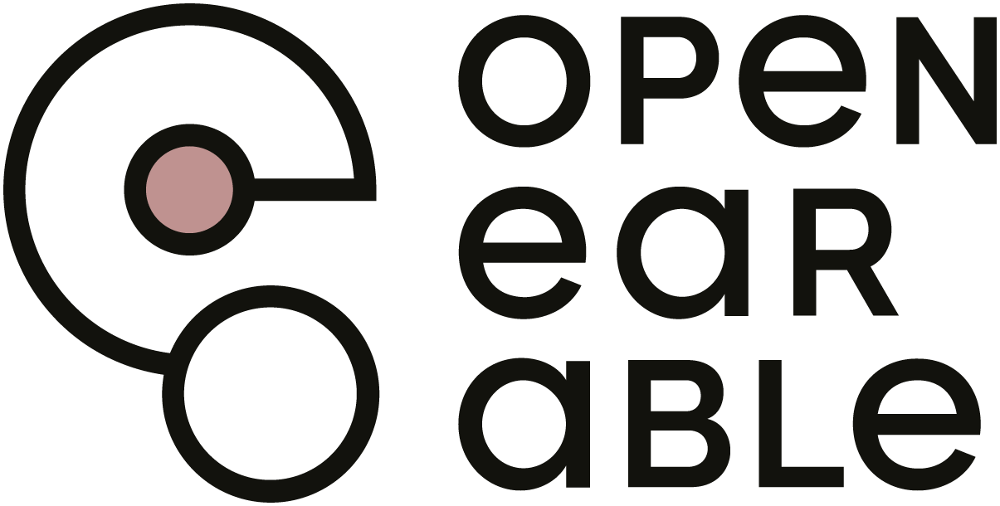

# 🎧 EarXplore



## 📝 About the Project

This Web Project was build as an additional to support the exploration of research on interaction with earables (as defined in the respective paper [EarXplore: An Open Earable Research Database on Interaction](https://github.com/OpenEarable/earXplore "Link to the Study which introduces this Repository")<!-- Add the right link -->. For the motivation and methodology of the review we therefore encourage anyone interested to read the paper themselves. The Web Project visualizes the EarXplore Database in four distinct views:

- Tabular View
- Graphical View
- Similarity View
- Timeline View

Please refer to the [Usage Section](#%EF%B8%8F-usage) or [Forking Section](#-forking) for more information.

## 🚀 Getting Started

### 💾 Installation
We highly recommend using a [virtual environment](https://docs.python.org/3/library/venv.html) in python to install all the dependencies from the [requirements.txt](./requirements.txt).  
In order to do that, activate your virtual environment in a terminal beforehand:  
```bash
# venv is the usual name for your virtual environment
path\to\venv\Scripts\activate
```
To install the depencies simply type:
```venv
pip install -r requirements.txt
```
To host your own version of the project locally type:
```terminal
flask run --debug
```
The `--debug` flag will apply any change you make to your project directly and restart the website on your machine. You can omit this flag.  
You can also change the host address and the port in the code and the bottom of the [app.py](./app.py) file:
```python
if __name__ == "__main__":
    app.run(debug=True, host="0.0.0.0", port=888) # you can change the debug mode, host and port
```

### 🔀 Forking
Although this website was designed to visualize data from studies about earables, the code can be altered to visualize just about any data if provided correctly. To visualize your data you need to alter the [data.csv](./data.csv) file (if you would like explanations for your categories, you will also need to update the [explanations.csv](./explanations.csv) file accordingly). ⚠️ The project will then filter all the information it needs from your data and produce a website from it. <!-- TODO: Add explanation for similarity and timeline view --> ⚠️. There are some customization options for the sidebar (see [Usage Section](#%EF%B8%8F-usage)):
```python
# Categories that should not be filtered for
EXCLUDED_SIDEBAR_CATEGORIES = ['ID', ...]

# Categories that go in the advanced filters panel
ADVANCED_SIDEBAR_CATEGORIES = ['Keywords', ...]

# Categories that are displayed as sliders in the sidebar, should be numerical !
SLIDER_CATEGORIES = ['Year', ...]

# Categories that should have a "select/deselect all" button in the sidebar
SELECT_DESELECT_ALL_CATEGORIES = ['Location', ...]

# Categories that should have an "exclusive filtering" button in the sidebar
EXCLUSIVE_FILTERING_CATEGORIES = ['Sensors', ...]

# Panels that should have a "select/deselect all" button in the sidebar
SELECT_DESELECT_ALL_PANELS = ['Interaction', 'Implementation', 'Study']

# Panels that should be initially hidden in the sidebar
INITIALLY_HIDDEN_PANELS = ['Advanced Filters']

# Columns that contain parentheses but only the part before the parentheses should be used for filtering
PARENTHICAL_COLUMNS = ['Interaction_PANEL_Accuracy of Interaction Recognition', ...]

# Categories that should be displayed initially in the tabular and bar chart views
# Do not delete the "INFO" category !
START_CATEGORY_FILTERS = json.dumps(["INFO", "Main Author", ...])

# Categories whose explanations should be formatted in a special way
SPECIAL_FORMAT_EXPLANATIONS = ["Interaction_PANEL_Discreetness of Interaction Techniques", ...]
```
This is the one of the two cases where you need to change the code to customize the website. Please make sure you spell the category exactly as in your data.csv file, otherwise it wont recognize it and therefore wont work as intended. Additionally you may want to configure the Mail-Server to your liking. Change the following code snippet for this use case:
```python
# Configure Flask-Mail
app.config['MAIL_SERVER'] = 'your-smtp-server.example.com'  # Replace with your SMTP server
app.config['MAIL_PORT'] = 587  # Common port for TLS
app.config['MAIL_USE_TLS'] = True
app.config['MAIL_USERNAME'] = 'your-email@example.com'  # Replace with your email
app.config['MAIL_PASSWORD'] = 'your-password'  # Replace with your password
app.config['MAIL_DEFAULT_SENDER'] = 'default-sender' # Replace with the default sender
```
If you are unsure about the some of the configurations, please refer to the [Flask Mail Documentation](https://pypi.org/project/Flask-Mail/).

## 🛠️ Usage

## 🚩 Issues

Currently there are no known issues. If you happen to encounter an issue with the website or need some insight on the code there are two ways to let us know:

1. This implementation of the website is currently hosted at earxplore.dmz.teco.edu <!-- Link not working, change to correct link -->. In the navigation bar you will find a button for reporting a mistake (or submitting an additional study). When clicked you are able to submit a form where you can specify your issue.
2. You can contact us directly by going to the [Contact Section](#-contact) and using a communication type of your choice.

## 🪪 License

⚠️ This project is currently licensed under the terms of the [MIT](./LICENSE) license. ⚠️

## 📩 Contact

⚠️ You can contact us either via this [GitHub Profile](https://github.com/98JoHu) or via E-Mail: jonas.hummel@kit.edu.
The full address of the institution which this project stems from is:

Vincenz-Prießnitz-Str.1  
Gebäude 07.07  
2.OG [TECO]  
76131 Karlsruhe 

Telefon: +49 721 608-41701  
Fax: +49 721 608-41702  
E-Mail: sekretariat@teco.edu ⚠️ 
