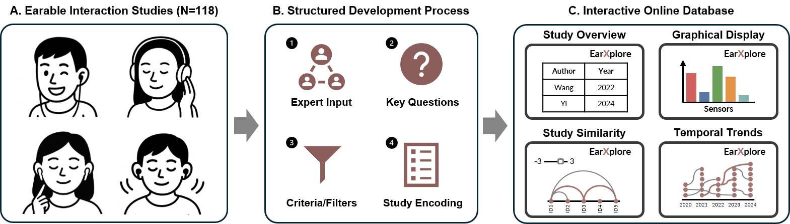

# 🎧 EarXplore



## 📝 About the Project

*EarXplore* is a curated, structured, and interactive online database consolidating published work on interaction with earables. Beyond merely listing studies, it supports in-depth exploration through four dynamic and integrated views that enable filtering, comparison, and visualization. The *Tabular View* presents a structured overview of all included studies, allowing users to filter and query based on multiple categories and criteria. The *Graphical View* provides a visual summary of key study characteristics, supporting quick comparisons and high-level insights. The *Similarity View* highlights connections between studies that share similar attributes, helping users discover related work. Finally, the *Timeline View* visualizes the temporal evolution of the field, revealing trends, citation links, and author networks. These views are interconnected, enabling users to explore data from multiple perspectives while maintaining context through features such as persistent filtering across all views. For more information on the project, we refer to an accompanying arXiv publication **!!! ADD LINK !!!** and to the *[EarXplore](https://earXplore.teco.edu "Link to the Study which introduces this Repository")* website itself.

## 🚀 Getting Started

### 💾 Installation
We highly recommend using a [virtual environment](https://docs.python.org/3/library/venv.html) in python to install all the dependencies from the [requirements.txt](./requirements.txt).  
In order to do that, activate your virtual environment in a terminal beforehand:  
```bash
# venv is the usual name for your virtual environment
path\to\venv\Scripts\activate
```
To install the depencies simply type:
```venv
pip install -r requirements.txt
```
To host your own version of the project locally, type:
```terminal
flask run --debug
```
The `--debug` flag will apply any change you make to your project directly and restart the website on your machine. You can omit this flag.  
You can also change the host address and the port in the code and the bottom of the [app.py](./app.py) file:
```python
if __name__ == "__main__":
    app.run(debug=True, host="0.0.0.0", port=888) # you can change the debug mode, host and port
```

### 🔀 Forking

While *EarXplore* was designed to visualize data from studies on earable interaction, its code can be reused to visualize just about any data with only minor additional configuration. To visualize your customized data, you need to adapt the [data.csv](./data.csv) according to your specific data points. Note that the header needs a special format that allows it to form different filter panels. If you would also like to have explanations for your categories, you will also need to update the [explanations.csv](./explanations.csv) file accordingly. The project will then extract all the information it needs from your data and produce a website from it. There are some customization options for the sidebar listed below (see [Usage Section](#%EF%B8%8F-usage)):
```python
# Categories that should not be filtered for
EXCLUDED_SIDEBAR_CATEGORIES = ['ID', ...]

# Categories that go in the advanced filters panel
ADVANCED_SIDEBAR_CATEGORIES = ['Keywords', ...]

# Categories that are displayed as sliders in the sidebar, should be numerical !
SLIDER_CATEGORIES = ['Year', ...]

# Categories that should have a "select/deselect all" button in the sidebar
SELECT_DESELECT_ALL_CATEGORIES = ['Location', ...]

# Categories that should have an "exclusive filtering" button in the sidebar
EXCLUSIVE_FILTERING_CATEGORIES = ['Sensors', ...]

# Panels that should have a "select/deselect all" button in the sidebar
SELECT_DESELECT_ALL_PANELS = ['Interaction', 'Implementation', 'Study']

# Panels that should be initially hidden in the sidebar
INITIALLY_HIDDEN_PANELS = ['Advanced Filters']

# Columns that contain parentheses but only the part before the parentheses should be used for filtering
PARENTHICAL_COLUMNS = ['Interaction_PANEL_Accuracy of Interaction Recognition', ...]

# Categories that should be displayed initially in the tabular and bar chart views
# Do not delete the "INFO" category !
START_CATEGORY_FILTERS = json.dumps(["INFO", "Main Author", ...])

# Categories whose explanations should be formatted in a special way
SPECIAL_FORMAT_EXPLANATIONS = ["Interaction_PANEL_Discreetness of Interaction Techniques", ...]
```
Following these instructions will give the full functionalities for the *Tabular* and *Graphical View*. 

To add the *Database* and *Abstract Similarity* metrics to the *Similarity View*, it is moreover necessary to run the [database_similarity.ipynb](./database_similarity.ipynb) and the [abstract_similarity.ipynb](./abstract_similarity.ipynb) to calculate both metrics. The the former, the headers of the [data.csv](./data.csv) need to be copied and pasted into the code along their datatype. For the latter, an API key is needed for gemini-embedding-exp-03-07 model in order to obtain the text embeddings. Of course, any other text embedding model can be employed as well but requires an according adaptation of the code. 

To add the citations and shared authors to the *Timeline View*, the grobid_citations_metadata.ipynb [grobid_citations_metadata.ipynb](./grobid_citations_metadata.ipynb) needs to be employed. [GROBID](https://grobid.readthedocs.io/en/latest/Introduction/) is a machine learning library that can extract scientific information from PDFs files. In order to run GROBID, you will need to employ Docker. More on this can be read in the relevant [GROBID documentation](https://grobid.readthedocs.io/en/latest/Run-Grobid/). To employ it your to data, you need to have a folder with the PDF files ready and specify their names in the notebook. In order to match them to you documents, you will also need to provide a file with the bibtexs of the studies. EXPAND

Additionally you may want to configure the Mail-Server to your liking. Change the following code snippet for this use case:
```python
# Configure Flask-Mail
app.config['MAIL_SERVER'] = 'your-smtp-server.example.com'  # Replace with your SMTP server
app.config['MAIL_PORT'] = 587  # Common port for TLS
app.config['MAIL_USE_TLS'] = True
app.config['MAIL_USERNAME'] = 'your-email@example.com'  # Replace with your email
app.config['MAIL_PASSWORD'] = 'your-password'  # Replace with your password
app.config['MAIL_DEFAULT_SENDER'] = 'default-sender' # Replace with the default sender
```
If you are unsure about the some of the configurations, please refer to the [Flask Mail Documentation](https://pypi.org/project/Flask-Mail/).

## 🛠️ Usage

This project is hosted under [earXplore.teco.edu](https://earxplore.teco.edu/). You may want to visit the site to try out all the features yourself. In this section there will be a quick introduction to the most important use cases for this project. You can navigate between the four different views and the *Add Your Study! / Report a Mistake!* section via the navbar:


In the sidebar on the right you can choose the values for every category to filter the data. There is also the option to select or deselect all the values depending on how you have configured the sidebar (see [Forking Section](#-forking)):


Similar to the sidebar filters for values of categories there are also individual filters for each view. For the *Tabular* and the *Graphical View* there are category filters to show or hide each category on its own. For the *Similarity* and *Timeline View* you can color the nodes representing a datapoint by category (choose the similarity type, citation mode, etc.). All the filter selections are consistent across all views. Here is a quick example on how you may use this feature:


Every info icon on the website is clickable. When clicked it shows a modal with the respective study information. Additionally you can click on the bars in the Graphical View to get an overview for all studies that match the value of the bar in the specific category of the chart. In the Similarity and Timeline View the nodes are also clickable. Upon clicking you receive information about the relationship to other studies in this specific network:


There are some other minor functionalities (for example the download of the Tabular view as a .csv file) but those are the key features of this project. Feel free to let us know if you wish for additional functionalities.

## 🚩 Issues

Currently there are no known issues. If you happen to encounter an issue with the website or need some insight on the code, there are two ways to let us know:

1. In the navigation bar of the *[EarXplore](https://earXplore.teco.edu "Link to the Study which introduces this Repository")* website, you will find a button for reporting a mistake (or submitting an additional study). Clicking it takes you to a where you can specify your issue.
2. You can contact us directly by going to the [Contact Section](#-contact).

## 🪪 License

This project is currently licensed under the terms of the [MIT](./LICENSE) license.

## 📩 Contact

You can contact us either via this [GitHub Profile](https://github.com/98JoHu) or via E-Mail: jonas.hummel@kit.edu.

